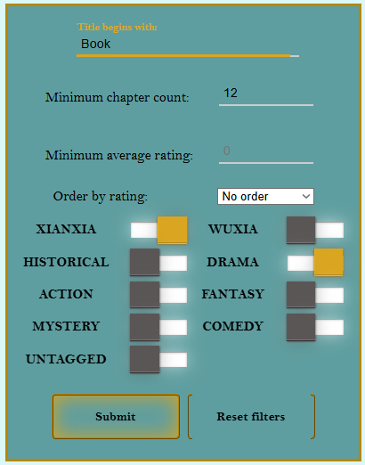
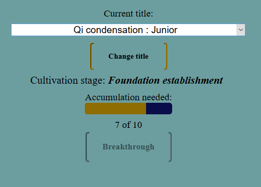
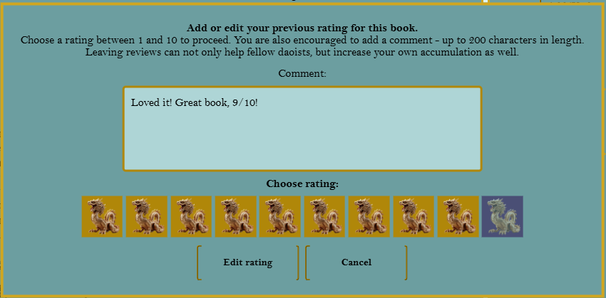
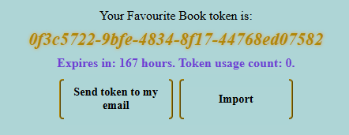

# The Library
## Place at which Chinese literature readers will find themselves right at home.

## Technologies used:

### Server: Spring Boot 3.3 (Java 21)
### Client: Angular v19

## Features:

Enjoy the cadet blue background with golden labels, offering a simplistic, yet elegant design, further accented by the presence of traditional Chinese
scroll paintings, and text or emails alike written in appropriate fashion.

### As a user of *The Library* you can be part of one or more of three main groups, each of them offering their respective features.

##### Guest readers

Everyone can be a guest reader. It means you have access to the following functionalities of the application:
- View all available books in a simple, user-friendly and efficient manner thanks to offset and keyset pagination and caching, including their:
    - Title
    - Author
    - Description
    - Chapter count
    - Average rating and rating count
    - Associated book tags
    - Current state of the book
    - Cover image
- Filter the available books by criteria such as, but not limited to:
    - Title
    - Author
    - Minimal chapter count
    - Minimal average rating
    - Set of book tags
    - State of the book
- View comments and respective ratings other users have left for each book
- Access all chapters and read them as you please by modifying:
    - Font used
    - Font size
    - Background colour
    - Space between paragraphs and lines
    - Text alignment
- Effortlessly look up the profiles of other users
- Access the *Pavilion of Glory* and view the top users
- Save books to your *Favourite book* collection
- Create and activate an account using the available system
- Quickly reset the password to your account with one click in a received email
- Register using your Google Account
- Login using Google Account or the available system

##### Fellow Daoists
After logging in to an existing account, you acquire the full privileges of a user.
Apart from those available to the *Guest Readers* you also can:
- Shape your profile, including:
    - Update a profile image
    - Adding a text of your liking
    - Changing your username every 90 days
    - Choose a special title that will be displayed alongside your username
    - Progress your cultivation by various activities, break through to higher stages, unlocking more customization options
      
- Leave reviews and comments that really matter on any chosen book:
    - Each of them has an immediate impact on a book's average rating
    - Increase your cultivation accumulation and help the book's author progress.
    - Edit them whenever you like, reflecting your new thoughts on the book
  
- Strive to the top in the *Pavilion of Glory* and be listed among the very best
- Access your *Favourite book* collection on any device, whenever and wherever you like
- Freely generate a token to share your *Favourite book* collection with other users:
    - all others need to do is to paste it in
    - See the token's usage
    - Send the token directly to your email to easily forward it to your friends  
    
- Subscribe to any number of books and never miss an update:
    - access your *Book subscriptions* on any device
    - receive an email whenever new chapters are added to a book in your subscription collection
- Be assured that your account will not get stolen thanks to the use of signed access and refresh JWT tokens

##### Authors
With an account old enough, anyone can become an author by accessing the *Author Tab*.
- Easily create new books with just a couple of clicks
- Edit or remove your existing ones
- Add and update chapters in your favourite format:
    - You apply the formating to the chapter, making it look however you wish
    - No need to copy the contents, simply upload the file in you of the supported formats:
        - New MS Word (.docx)
        - Old MS Word (.doc)
        - OpenOffice (.odt)
        - Plain text (.txt)
    - Mark them as spoilers, obscuring their titles from *Subscribed books* notifications and website view, unless a
      user specifically reveals them
    - Automatically notify everyone interested in your book about the new chapters by sending a notification email to subscribers
- Swiftly advance your cultivation by receiving authoring bonuses, proportional to your books' performance

## Running the application
